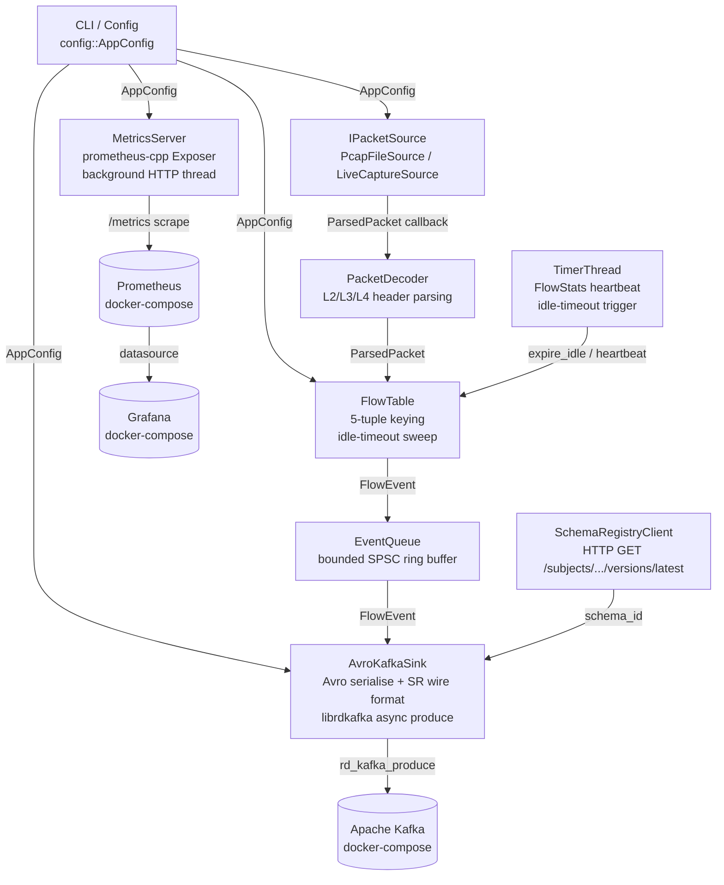

# PacketPipe — Architecture & Design Document

**Version:** 1.0  
**Date:** 2026-08-04  
**Author:** System Architect  
**Status:** Ready for Implementation

---

## Table of Contents

1. [Open Question Resolutions](#1-open-question-resolutions)
2. [Architecture Overview](#2-architecture-overview)
3. [Module Breakdown](#3-module-breakdown)
4. [Key Interfaces & Data Types](#4-key-interfaces--data-types)
5. [Data Flow](#5-data-flow)
6. [Threading Model](#6-threading-model)
7. [Shutdown Model](#7-shutdown-model)
8. [Error Handling Strategy](#8-error-handling-strategy)
9. [Avro Schema Design & Schema Registry Strategy](#9-avro-schema-design--schema-registry-strategy)
10. [Kafka Producer Design](#10-kafka-producer-design)
11. [Metrics Model & Dashboard Signal Mapping](#11-metrics-model--dashboard-signal-mapping)
12. [CMake Target Layout](#12-cmake-target-layout)
13. [vcpkg Dependency Manifest](#13-vcpkg-dependency-manifest)
14. [Test Strategy](#14-test-strategy)
15. [Design Decisions & Trade-offs](#15-design-decisions--trade-offs)
16. [Risks & Mitigations](#16-risks--mitigations)
17. [Handoff Statement](#17-handoff-statement)

---

## 1. Open Question Resolutions

All OQ-1 through OQ-7 are resolved here. No further Product Owner input is required before implementation begins.

| ID | Resolution | Rationale |
|----|-----------|-----------|
| **OQ-1** | FlowStats heartbeat events are emitted for **all** active flows regardless of per-interval activity. | Ensures the consumer sees liveness signals for long-lived idle flows (e.g., a stale SSH session). The cost is negligible because FR-FLOW-6 caps flows at 100 000 and the heartbeat interval is ≥ 30 s. This simplifies the timer loop: no per-flow dirty-bit. |
| **OQ-2** | Each direction is tracked as a **separate unidirectional 5-tuple**. A→B and B→A are distinct flows. | Bidirectional merging requires canonicalising the key (min/max IP comparison), complicates ICMP type/code semantics, and adds a second lookup per packet. For a portfolio demo showing flow lifecycle events, unidirectional flows are cleaner to reason about and debug. If bidirectional merging is desired in a future iteration, it can be layered as a post-processing step in the consumer, not the producer. |
| **OQ-3** | Schema Registry compatibility mode: **BACKWARD**. | BACKWARD allows a new schema version to add optional fields (with Avro defaults). Existing consumers compiled against the old schema continue to function. FULL (BACKWARD + FORWARD) requires that old producers still work with a new schema, which is unnecessary here since we control the single producer. NONE provides no safety net. |
| **OQ-4** | `docker-compose.yml` assumes the `packetpipe` binary is **pre-built on the host**. | Adding a multi-stage build container to docker-compose couples the build system to Docker, complicates the CI/native-build path, and inflates image build time in the demo. A standalone `Dockerfile.build` may be provided as an optional convenience but is not part of `docker-compose up`. The README quick-start will document the two-step sequence: build binary first, then `docker-compose up`. |
| **OQ-5** | The topic is **pre-created** by the demo setup with **6 partitions, replication factor 1**. Auto-creation is enabled in the broker config as a fallback, but a `kafka-init` init-container in `docker-compose.yml` will explicitly create the topic at the correct partition count. | Auto-creation uses the broker default (1 partition), which under-parallelises the demo. Six partitions provides visible per-partition distribution in the Grafana consumer-lag panel. |
| **OQ-6** | Kafka message retention: **7 days** (Kafka default). No override is applied. | Sufficient for demo replay and portfolio review sessions. Explicitly documented in the `docker-compose.yml` service environment block for auditability. |
| **OQ-7** | The `/metrics` HTTP endpoint is served by a **background thread inside the main process** using the prometheus-cpp pull-mode `Exposer`. | prometheus-cpp's `Exposer` spawns and manages its own Civetweb-based HTTP thread internally. No external sidecar process is needed. The binary remains self-contained (SC-5), deployment is trivial, and the thread is stopped cleanly in the shutdown sequence by destroying the `Exposer` object. |

---

## 2. Architecture Overview

### Component Diagram



### Deployment Topology

```
Host machine
├── packetpipe binary          (built from source, run by operator)
│   ├── CaptureThread          libpcap dispatch loop
│   ├── TimerThread            heartbeat + idle expiry
│   ├── AvroKafkaSink thread   serialize + produce
│   └── MetricsThread          prometheus-cpp Exposer (internal)
│
└── docker-compose network
    ├── kafka:9092             Kafka broker (KRaft mode)
    ├── schema-registry:8081   Confluent Schema Registry
    ├── prometheus:9090        Prometheus (scrapes host 0.0.0.0:9090)
    └── grafana:3000           Grafana
```

> **Note to developer:** Prometheus is exposed on the host at `localhost:9091` (per FR-DEMO-4) and scrapes `packetpipe` at `host.docker.internal:9090` (or the bridge gateway IP).

---

## 3. Module Breakdown

The repository is split into seven static library targets and one executable. Each library corresponds to a single concern. The `main.cpp` executable wires them together.

### 3.1 `packetpipe_config`

**Headers:** `src/config/app_config.hpp`  
**Responsibility:** Parse CLI arguments via a minimal custom argument parser (no heavy CLI framework dependency), validate mutual exclusivity of `--pcap` / `--iface`, and produce a validated `AppConfig` value type. Exits with code 1 and a usage message on invalid input (FR-ING-3).

**Key types:**
```
AppConfig          – plain struct of all runtime parameters (copyable, no logic)
ConfigParser       – static parse(argc, argv) → AppConfig (throws on invalid input)
```

**Dependencies:** C++ standard library only.

**Coupling note:** All other modules receive `AppConfig` by const reference at construction time. No module reaches back into `config` after startup.

---

### 3.2 `packetpipe_packets`

**Headers:** `src/packets/parsed_packet.hpp`, `src/packets/packet_decoder.hpp`, `src/packets/ipacket_source.hpp`  
**Responsibility:** Defines the `ParsedPacket` POD and the `IPacketSource` interface. Implements `PcapFileSource` and `LiveCaptureSource` (both wrap libpcap). Contains `PacketDecoder` which parses raw bytes into `ParsedPacket`.

**Key types:**
```
ParsedPacket       – POD; see §4.1
IPacketSource      – abstract interface; see §4.2
PcapFileSource     – implements IPacketSource using pcap_open_offline
LiveCaptureSource  – implements IPacketSource using pcap_open_live
PacketDecoder      – stateless; decode(const u_char* data, uint32_t len, timeval ts) → std::optional<ParsedPacket>
```

**Dependencies:** libpcap (system or vcpkg).

**Ownership:** `IPacketSource` is heap-allocated and owned by `main.cpp` via `std::unique_ptr<IPacketSource>`.

---

### 3.3 `packetpipe_flowtable`

**Headers:** `src/flowtable/flow_key.hpp`, `src/flowtable/flow_state.hpp`, `src/flowtable/flow_table.hpp`  
**Responsibility:** Maintains the in-memory flow table. Receives `ParsedPacket` on the capture thread, updates or creates `FlowState`, and emits `FlowEvent` values via a registered callback. Implements idle-timeout sweep and TCP teardown detection. Enforces the `--max-flows` cap.

**Key types:**
```
FlowKey            – struct; equality + hash; see §4.1
FlowState          – struct; per-flow counters and timestamps
FlowTable          – owns std::unordered_map<FlowKey, FlowState, FlowKeyHash>
                     process(ParsedPacket) — called from capture thread
                     expire_idle(now_us)   — called from timer thread (thread-safe via internal mutex)
                     drain_all(now_us)     — called at shutdown from capture thread after capture stops
```

**Threading:** `process()` is called only from the capture thread. `expire_idle()` and `drain_all()` acquire the same internal `std::mutex`. The timer thread must not call `process()` and the capture thread must not call `expire_idle()` simultaneously — the mutex ensures safety.

**Dependencies:** `packetpipe_packets` (for `ParsedPacket`), `packetpipe_events` (for `FlowEvent`), `packetpipe_metrics` (for counter/gauge handles injected at construction).

---

### 3.4 `packetpipe_events`

**Headers:** `src/events/flow_event.hpp`, `src/events/event_queue.hpp`  
**Responsibility:** Defines the `FlowEvent` sum type and a bounded, lock-free SPSC ring buffer (`EventQueue`) used to pass events from the capture thread to the AvroKafkaSink thread.

**Key types:**
```
FlowEventType      – enum class { Start, End, Stats }
ExpireReason       – enum class { IdleTimeout, TcpTeardown }
FlowEvent          – struct; see §4.1
EventQueue<N>      – templated fixed-capacity SPSC ring buffer
                     push(FlowEvent) → bool (false = full, caller must handle)
                     pop()           → std::optional<FlowEvent>
```

**Capacity:** Default 65 536 slots (`--event-queue-size` is not a CLI flag; fix it at compile time via a `constexpr` constant). At the 100 kpkt/s target rate, 65 536 slots provides > 600 ms of headroom before back-pressure — sufficient for the AvroKafka thread to keep up.

**Dependencies:** C++ standard library only (`std::atomic`, `std::array`).

**Lock-free design:** Implemented as a single-producer / single-consumer ring buffer using two `std::atomic<size_t>` indices (head and tail) with `std::memory_order_release` / `_acquire` ordering. No mutex needed.

---

### 3.5 `packetpipe_avro`

**Headers:** `src/avro/avro_serializer.hpp`, `src/avro/schema_registry_client.hpp`  
**Responsibility:** Loads the `FlowEvent.avsc` schema at startup, registers or looks up the schema ID from the Schema Registry via HTTP, and serializes `FlowEvent` structs into the Confluent wire format (magic byte 0x00 + 4-byte big-endian schema ID + Avro binary payload).

**Key types:**
```
SchemaRegistryClient  – constructor(url, subject) → fetches schema_id via HTTP GET
                        get_schema_id() → int32_t
AvroSerializer        – constructor(schema_path, SchemaRegistryClient&)
                        serialize(FlowEvent) → std::vector<uint8_t>
                                             → throws AvroSerializationError on failure
```

**Schema Registry interaction:** At startup, `SchemaRegistryClient` performs an HTTP GET to `<url>/subjects/<subject>/versions/latest`. On success it extracts `id` (int32). On failure it throws `SchemaRegistryUnavailableError` (caught in `main()` → exit code 1, FR-SER-4 fail-fast). During operation, schema ID is cached in memory; no re-fetch is needed.

**HTTP client:** Uses `cpp-httplib` (header-only, vcpkg). No persistent connection is maintained for the single startup lookup.

**Schema buffer (FR-SER-4):** If the registry is unreachable at startup, we fail fast. If it becomes unreachable during operation, serialization itself does not contact the registry again (the ID is cached), so FR-SER-4's buffer-and-retry requirement applies only to the Kafka delivery path, handled in `packetpipe_kafka`.

**Dependencies:** `avro-cpp` (vcpkg), `cpp-httplib` (vcpkg), `packetpipe_events`.

---

### 3.6 `packetpipe_kafka`

**Headers:** `src/kafka/avro_kafka_sink.hpp`, `src/kafka/kafka_producer.hpp`  
**Responsibility:** Wraps librdkafka's C++ API. `KafkaProducer` manages the `RdKafka::Producer` lifecycle. `AvroKafkaSink` implements `IEventSink`, runs its own thread that drains `EventQueue`, calls `AvroSerializer`, and calls `KafkaProducer::produce()`. Handles delivery report callbacks to update metrics.

**Key types:**
```
IEventSink            – abstract; push(FlowEvent), flush(duration)
KafkaProducer         – RAII wrapper around RdKafka::Producer + RdKafka::Topic
                        produce(key, payload) → void
                        flush(timeout_ms) → void
AvroKafkaSink         – implements IEventSink
                        start() / stop() — manages the sink thread
                        Internal buffer for FR-SER-4 retry: a std::deque<FlowEvent>
                          capped at --sr-buffer (default 1000) items.
                          If Kafka delivery fails, the event is re-queued up to the cap.
DeliveryReportCb      – RdKafka::DeliveryReportCb impl; increments metrics on error
```

**Message key encoding (FR-KAF-3):** The canonical 5-tuple string format is:
```
<src_ip>:<src_port>-<dst_ip>:<dst_port>/<protocol>
```
IPv6 addresses are enclosed in brackets: `[2001:db8::1]:1234`. This string is the Kafka message key (UTF-8 bytes).

**Dependencies:** `librdkafka` (vcpkg), `packetpipe_avro`, `packetpipe_events`, `packetpipe_metrics`.

---

### 3.7 `packetpipe_metrics`

**Headers:** `src/metrics/metrics_registry.hpp`  
**Responsibility:** Initialises the prometheus-cpp `Registry`, creates all metric families with the `version` label, exposes an `IMetricsRegistry` interface that vends typed counter/gauge handles. Owns and starts the `prometheus::Exposer`.

**Key types:**
```
IMetricsRegistry   – pure abstract: counters and gauges accessible by name
MetricsRegistry    – concrete implementation; owns prometheus::Registry
                     and prometheus::Exposer
                     start(port)  — starts the HTTP thread
                     stop()       — destroys Exposer, stops thread
```

**Injection pattern:** `MetricsRegistry` is constructed in `main()` and injected by reference into `FlowTable`, `AvroKafkaSink`, `PacketDecoder`, and `KafkaProducer`. No module holds a pointer longer than `MetricsRegistry`'s lifetime.

**Dependencies:** `prometheus-cpp` (vcpkg).

---

## 4. Key Interfaces & Data Types

### 4.1 Core Data Structures (pseudocode signatures)

```cpp
// src/packets/parsed_packet.hpp
struct ParsedPacket {
    std::array<uint8_t, 16> src_ip;   // IPv4-mapped-IPv6 for uniform handling
    std::array<uint8_t, 16> dst_ip;
    uint16_t src_port;                 // ICMP: type in high byte, code in low byte
    uint16_t dst_port;
    uint8_t  protocol;                 // IPPROTO_TCP, _UDP, _ICMP, _ICMPV6
    uint32_t wire_length;              // bytes on wire (IP total length)
    int64_t  timestamp_us;             // microseconds since Unix epoch
    bool     tcp_fin;
    bool     tcp_rst;
    bool     is_ipv6;
};

// src/flowtable/flow_key.hpp
struct FlowKey {
    std::array<uint8_t, 16> src_ip;
    std::array<uint8_t, 16> dst_ip;
    uint16_t src_port;
    uint16_t dst_port;
    uint8_t  protocol;
    // operator== and FlowKeyHash defined in the same header
};

// src/flowtable/flow_state.hpp
struct FlowState {
    FlowKey  key;
    int64_t  start_us;
    int64_t  last_seen_us;
    uint64_t packet_count;
    uint64_t byte_count;
};

// src/events/flow_event.hpp
enum class FlowEventType  : uint8_t { Start, End, Stats };
enum class ExpireReason   : uint8_t { IdleTimeout, TcpTeardown };

struct FlowEvent {
    FlowEventType type;
    FlowState     state;
    int64_t       event_timestamp_us;  // when the event was generated
    ExpireReason  reason;              // meaningful only for FlowEventType::End
};

// src/config/app_config.hpp
struct AppConfig {
    // Ingestion
    std::string  pcap_file;            // empty if --iface used
    std::string  iface;                // empty if --pcap used
    std::string  bpf_filter;

    // Flow table
    int          flow_timeout_sec;     // default 60
    int          max_flows;            // default 100'000
    int          stats_interval_sec;   // default 30

    // Kafka
    std::string  kafka_brokers;        // default "localhost:9092"
    std::string  kafka_topic;          // default "packetpipe.flows"
    std::string  kafka_conf_file;      // optional

    // Schema Registry
    std::string  schema_registry_url;  // default "http://localhost:8081"
    int          sr_buffer_size;       // default 1'000

    // Metrics
    uint16_t     metrics_port;         // default 9090

    // Logging
    std::string  log_level;            // default "info"

    // Application version (injected at compile time via CMake)
    std::string  version;
};
```

### 4.2 `IPacketSource` Interface

```cpp
// src/packets/ipacket_source.hpp
class IPacketSource {
public:
    virtual ~IPacketSource() = default;

    // Blocks until end-of-file (pcap) or stop() is called (live).
    // Invokes callback synchronously for every successfully decoded packet.
    // Thread: capture thread only.
    virtual void run(std::function<void(const ParsedPacket&)> callback) = 0;

    // Thread-safe. Causes run() to return on next packet boundary.
    // Called by signal handler shim.
    virtual void stop() noexcept = 0;

    // Returns a human-readable description for log output.
    virtual std::string description() const = 0;
};
```

### 4.3 `IEventSink` Interface

```cpp
// src/kafka/ievent_sink.hpp
class IEventSink {
public:
    virtual ~IEventSink() = default;

    // Non-blocking; returns false if the internal queue is full.
    virtual bool push(FlowEvent evt) noexcept = 0;

    // Block until all pushed events are produced to Kafka or timeout elapses.
    virtual void flush(std::chrono::milliseconds timeout) = 0;
};
```

### 4.4 `IMetricsRegistry` Interface

```cpp
// src/metrics/imetrics_registry.hpp
class IMetricsRegistry {
public:
    virtual ~IMetricsRegistry() = default;

    virtual prometheus::Counter& packets_received()              = 0;
    virtual prometheus::Counter& packets_dropped()               = 0;
    virtual prometheus::Gauge&   flows_active()                  = 0;
    virtual prometheus::Counter& flows_created()                 = 0;
    virtual prometheus::Counter& flows_expired(ExpireReason r)   = 0;
    virtual prometheus::Counter& kafka_messages_produced()       = 0;
    virtual prometheus::Counter& kafka_delivery_errors()         = 0;
    virtual prometheus::Counter& avro_serialization_errors()     = 0;
    virtual prometheus::Counter& schema_registry_retries()       = 0;
};
```

---

## 5. Data Flow

```
libpcap raw bytes
        │
        ▼ (capture thread)
PacketDecoder::decode()
        │ std::optional<ParsedPacket>
        │ (malformed → packets_dropped++ → discard)
        ▼
FlowTable::process(ParsedPacket)
  ├─ new flow     → emit FlowEvent{Start} → EventQueue::push()
  │               → flows_active++, flows_created++
  ├─ update       → update FlowState (packet_count, byte_count, last_seen_us)
  │               → (TCP FIN/RST) → emit FlowEvent{End, TcpTeardown}
  │                                → flows_active--, flows_expired(TcpTeardown)++
  └─ over cap     → packets_dropped++, warn log

TimerThread (every stats_interval_sec)
        │
        ▼
FlowTable::heartbeat_sweep(now_us)
  ├─ for each active flow → emit FlowEvent{Stats}
  └─ for each expired flow (last_seen + timeout < now) → emit FlowEvent{End, IdleTimeout}
                                                         → flows_active--, flows_expired(IdleTimeout)++

EventQueue (SPSC ring, capacity 65536)
        │
        ▼ (AvroKafka thread)
AvroSerializer::serialize(FlowEvent) → std::vector<uint8_t>
  ├─ failure → avro_serialization_errors++ → discard event
  └─ success →
KafkaProducer::produce(key, payload)
  ├─ enqueue to librdkafka → kafka_messages_produced++
  └─ delivery report callback:
       error  → kafka_delivery_errors++ → re-queue up to sr_buffer_size
       success → no-op
```

---

## 6. Threading Model

| Thread | Identity | Blocking Operations | Owns |
|--------|----------|---------------------|------|
| **Capture** | `main` thread | `IPacketSource::run()` (pcap dispatch) | `FlowTable`, `PacketDecoder` |
| **Timer** | `std::jthread` | `std::this_thread::sleep_for(stats_interval / 2)` | — (calls into FlowTable under its mutex) |
| **AvroKafka** | `std::jthread` | `EventQueue::pop_wait()` (condition variable) | `AvroSerializer`, `KafkaProducer` |
| **Metrics** | internal to `prometheus::Exposer` | `accept()` on metrics port | — |

### Synchronisation Boundaries

1. **Capture → Timer** (FlowTable internal mutex): Both threads call into `FlowTable`. The capture thread holds the lock only for the duration of a single `process()` call (< 1 µs). The timer thread holds the lock during the full sweep. Sweep frequency is ≤ 1 Hz, so contention is negligible.

2. **Capture → AvroKafka** (EventQueue SPSC): Lock-free ring buffer. No mutex. The capture thread is the sole producer; the AvroKafka thread is the sole consumer.

3. **AvroKafka → librdkafka delivery callback**: librdkafka invokes delivery callbacks on the AvroKafka thread when `rd_kafka_poll()` is called after `produce()`. The callback only increments atomic metric counters — no further synchronisation needed.

4. **Signal handler → capture thread**: Signal handler sets a `std::atomic<bool> g_shutdown` flag and calls `IPacketSource::stop()` (which internally calls `pcap_breakloop()`). Signal-handler-safe: `pcap_breakloop` is async-signal-safe; the atomic store uses the default sequentially-consistent ordering.

### Performance Notes

- The capture → flow-table path is entirely on one thread. No per-packet allocation: `FlowState` is stored by value in an `unordered_map`; `ParsedPacket` is passed by const reference.
- `FlowKey` hashing uses a constexpr FNV-1a hash over the 37-byte key content. This is cheaper than `std::hash` on `std::string` (avoids heap allocation).
- `EventQueue::push()` is a single atomic store; no contention with the pop side.

---

## 7. Shutdown Model

Signal receipt to clean exit proceeds in the following ordered steps:

```
Step 1  SIGINT / SIGTERM received
        → signal handler: g_shutdown.store(true); source->stop();

Step 2  IPacketSource::run() returns (pcap_breakloop causes dispatch to exit)

Step 3  Capture thread (after run() returns):
        → FlowTable::drain_all(now_us)
            emits FlowEvent{End, IdleTimeout} for every still-active flow
            flows_active gauge → 0

Step 4  Capture thread:
        → EventQueue: push sentinel (FlowEvent with type = Sentinel, or check g_shutdown in pop loop)

Step 5  Timer thread (std::jthread stop token):
        → stop_token requested → exits sleep, returns

Step 6  AvroKafkaSink thread:
        → drains EventQueue until sentinel / queue empty AND g_shutdown == true
        → KafkaProducer::flush(9000 ms)   [leaves 1s margin within FR-KAF-5's 10s]
        → rd_kafka_destroy()
        → thread exits

Step 7  main() joins AvroKafka jthread (destructor of std::jthread), joins Timer jthread

Step 8  MetricsRegistry destructor destroys prometheus::Exposer
        → metrics HTTP thread stops

Step 9  main() returns 0
```

**Timeout enforcement (FR-KAF-5):** `KafkaProducer::flush()` uses `rd_kafka_flush(handle, 9000)`. If the 9-second flush times out, a warning is logged (remaining queue size), and the producer is destroyed anyway. The process never hangs beyond 10 s total after shutdown signal.

---

## 8. Error Handling Strategy

The design uses a **two-tier** approach:

### Tier 1: Startup / Configuration (Exceptions)

All errors during initialisation are reported via exceptions and caught in `main()` with a human-readable message and `exit(1)`. This covers:
- Invalid CLI arguments (FR-ING-3): `std::invalid_argument`
- pcap open failure: `PcapOpenError`
- CAP_NET_RAW check failure (NFR-PORT-3): `PrivilegeError`
- Schema Registry unreachable (FR-SER-4 fail-fast): `SchemaRegistryUnavailableError`
- Kafka broker connection failure at startup: `KafkaInitError`

```cpp
// main.cpp pattern (pseudocode)
try {
    auto cfg   = ConfigParser::parse(argc, argv);
    auto src   = make_packet_source(cfg);
    auto reg   = MetricsRegistry(cfg);
    auto sr    = SchemaRegistryClient(cfg.schema_registry_url, "packetpipe-FlowEvent");
    auto avro  = AvroSerializer("schemas/FlowEvent.avsc", sr);
    auto kafka = KafkaProducer(cfg);
    auto sink  = AvroKafkaSink(avro, kafka, cfg, reg);
    auto table = FlowTable(cfg, reg, sink);
    // ... start threads, run capture loop
} catch (const AppError& e) {
    std::cerr << "[error] " << e.what() << "\n";
    return 1;
}
```

### Tier 2: Hot Path (Error Codes + Metrics)

No exceptions in the capture or AvroKafka hot path. Errors are counted and logged at `debug` level:

| Error Condition | Action |
|----------------|--------|
| Malformed packet from libpcap | `packets_dropped_total++`, log at `debug`, continue |
| Unrecognised L3/L4 protocol | `packets_dropped_total++`, discard |
| Flow table at capacity | `packets_dropped_total++`, log `warn` once per 1000 drops |
| Avro serialization failure | `avro_serialization_errors_total++`, discard event |
| Kafka delivery failure | `kafka_delivery_errors_total++`, re-queue up to `sr_buffer_size` |
| EventQueue full (capture too fast) | `packets_dropped_total++`, log `warn` |

### Logging

Use `spdlog` (vcpkg) with a synchronous stdout sink for the capture thread and an async sink for the AvroKafka thread (to avoid I/O stalls in the hot path). Log format:
```
[2026-08-04T12:00:00.000Z] [INFO ] [capture] FlowStart key=192.168.1.1:1234-10.0.0.1:80/TCP
```
Log level is set at startup from `--log-level` by calling `spdlog::set_level()`.

---

## 9. Avro Schema Design & Schema Registry Strategy

### 9.1 Schema File

A single schema file `schemas/FlowEvent.avsc` describes all three event types using an `event_type` enum discriminator. This maps to **one Schema Registry subject**: `packetpipe-FlowEvent-value`.

```json
{
  "type": "record",
  "name": "FlowEvent",
  "namespace": "io.packetpipe",
  "doc": "Unified flow lifecycle event. event_type discriminates Start/End/Stats.",
  "fields": [
    {
      "name": "schema_version",
      "type": "string",
      "default": "1.0",
      "doc": "SemVer major.minor of this schema."
    },
    {
      "name": "event_type",
      "type": {
        "type": "enum",
        "name": "EventType",
        "symbols": ["FLOW_START", "FLOW_END", "FLOW_STATS"]
      }
    },
    {
      "name": "flow_id",
      "type": "string",
      "doc": "Canonical 5-tuple string; also used as Kafka message key."
    },
    { "name": "src_ip",   "type": "string" },
    { "name": "dst_ip",   "type": "string" },
    { "name": "src_port", "type": "int",    "doc": "ICMP: type<<8|code" },
    { "name": "dst_port", "type": "int" },
    { "name": "protocol", "type": "int",    "doc": "IPPROTO_* value" },
    { "name": "start_timestamp_us",  "type": "long" },
    { "name": "event_timestamp_us",  "type": "long" },
    { "name": "packet_count",        "type": "long" },
    { "name": "byte_count",          "type": "long" },
    {
      "name": "expire_reason",
      "type": ["null", "string"],
      "default": null,
      "doc": "Non-null only for FLOW_END. Values: idle_timeout | tcp_teardown"
    }
  ]
}
```

### 9.2 Schema Registration Procedure (Demo Setup)

The `demo/scripts/register_schema.sh` script (invoked by the kafka-init service in docker-compose) POSTs the schema to the registry before `packetpipe` starts:

```
POST http://localhost:8081/subjects/packetpipe-FlowEvent-value/versions
Content-Type: application/vnd.schemaregistry.v1+json
{"schema": "<escaped JSON of FlowEvent.avsc>", "schemaType": "AVRO"}
```

Compatibility mode is set to BACKWARD on the subject before first registration:
```
PUT http://localhost:8081/config/packetpipe-FlowEvent-value
{"compatibility": "BACKWARD"}
```

### 9.3 Wire Format (FR-SER-3)

Each Kafka message value byte layout:
```
[0x00][schema_id (4 bytes big-endian)][avro binary payload ...]
```

`AvroSerializer::serialize()` constructs this buffer:
1. Write `0x00` magic byte.
2. Write `schema_id` as 4-byte big-endian (network byte order).
3. Encode `FlowEvent` to Avro binary using `avro::GenericDatum` and `avro::EncoderPtr`.

### 9.4 Schema Evolution Policy

- Patch changes (bug fixes, doc updates): no schema version bump.
- Adding optional fields with defaults: bump minor (e.g., `1.0` → `1.1`); BACKWARD-compatible.
- Removing or renaming fields: bump major; requires coordinating consumer upgrades; out of scope for v1.

---

## 10. Kafka Producer Design

### Configuration Hierarchy (FR-KAF-6)

librdkafka config is built in layers (later layers override earlier):

1. Hardcoded defaults in `KafkaProducer` constructor:
   - `compression.codec = snappy`
   - `batch.num.messages = 1000`
   - `linger.ms = 5`
   - `enable.idempotence = false` (at-least-once is acceptable per SC-7)
   - `message.send.max.retries = 3`

2. Parsed from `--kafka-conf <file>` (if provided): standard librdkafka `.conf` format (`key=value` lines). Applied via `rd_kafka_conf_set()`.

3. Overridden programmatically: `bootstrap.servers` from `--kafka-brokers`.

### Partitioning Strategy (FR-KAF-3)

The Kafka message **key** is the canonical `flow_id` string (same field as in the Avro record). librdkafka's default murmur2 partitioner distributes keys consistently across partitions. All events for a given flow will land on the same partition, providing ordering guarantees within a flow.

### Back-pressure and Retry Buffer (FR-SER-4)

```
AvroKafkaSink::push(FlowEvent):
  serialize → if error: avro_serialization_errors++, return
  produce   → if librdkafka queue full: add to retry_deque
              if retry_deque.size() >= sr_buffer_size: discard oldest, log warn

AvroKafkaSink thread loop:
  while not shutdown:
    drain retry_deque first (re-attempt produces)
    pop from EventQueue (wait up to 10ms)
    serialize + produce
    rd_kafka_poll(0)   // trigger delivery callbacks
```

---

## 11. Metrics Model & Dashboard Signal Mapping

### 11.1 Prometheus Metric Definitions

All metrics carry the label `version="<semver>"` (from `AppConfig::version`, injected at compile time via `project(packetpipe VERSION x.y.z)` in CMakeLists.txt).

| Metric Name | Type | Additional Labels | Source Module |
|-------------|------|-------------------|---------------|
| `packetpipe_packets_received_total` | Counter | — | `PacketDecoder` (incremented before decode) |
| `packetpipe_packets_dropped_total` | Counter | — | `PacketDecoder`, `FlowTable` |
| `packetpipe_flows_active` | Gauge | — | `FlowTable` |
| `packetpipe_flows_created_total` | Counter | — | `FlowTable` |
| `packetpipe_flows_expired_total` | Counter | `reason=idle_timeout\|tcp_teardown` | `FlowTable` |
| `packetpipe_kafka_messages_produced_total` | Counter | — | `KafkaProducer` |
| `packetpipe_kafka_delivery_errors_total` | Counter | — | `DeliveryReportCb` |
| `packetpipe_avro_serialization_errors_total` | Counter | — | `AvroSerializer` |
| `packetpipe_schema_registry_retries_total` | Counter | — | `AvroKafkaSink` retry loop |

### 11.2 Grafana Dashboard Panels

The pre-provisioned dashboard (`demo/grafana/dashboards/packetpipe.json`) shall contain these panels:

| Panel Title | Type | PromQL Expression |
|-------------|------|-------------------|
| Packets Received Rate | Time series | `rate(packetpipe_packets_received_total[1m])` |
| Active Flows | Stat / Gauge | `packetpipe_flows_active` |
| Kafka Messages Rate | Time series | `rate(packetpipe_kafka_messages_produced_total[1m])` |
| Kafka Delivery Error Rate | Time series | `rate(packetpipe_kafka_delivery_errors_total[1m])` |
| Packets Dropped Rate | Time series | `rate(packetpipe_packets_dropped_total[1m])` |
| Flows Created Rate | Time series | `rate(packetpipe_flows_created_total[1m])` |
| Flow Expiry Breakdown | Time series | `rate(packetpipe_flows_expired_total[1m])` by `reason` |
| Avro / SR Errors | Stat | `increase(packetpipe_avro_serialization_errors_total[5m])` |

---

## 12. CMake Target Layout

### Repository Directory Structure

```
packetpipe/
├── CMakeLists.txt                  root; orchestrates all targets
├── CMakePresets.json               debug + release configure presets
├── vcpkg.json                      dependency manifest
├── src/
│   ├── config/
│   │   ├── CMakeLists.txt
│   │   ├── app_config.hpp
│   │   └── config_parser.cpp
│   ├── packets/
│   │   ├── CMakeLists.txt
│   │   ├── ipacket_source.hpp
│   │   ├── parsed_packet.hpp
│   │   ├── packet_decoder.hpp
│   │   ├── packet_decoder.cpp
│   │   ├── pcap_file_source.hpp
│   │   ├── pcap_file_source.cpp
│   │   ├── live_capture_source.hpp
│   │   └── live_capture_source.cpp
│   ├── flowtable/
│   │   ├── CMakeLists.txt
│   │   ├── flow_key.hpp
│   │   ├── flow_state.hpp
│   │   ├── flow_table.hpp
│   │   └── flow_table.cpp
│   ├── events/
│   │   ├── CMakeLists.txt
│   │   ├── flow_event.hpp
│   │   └── event_queue.hpp         (header-only template)
│   ├── avro/
│   │   ├── CMakeLists.txt
│   │   ├── avro_serializer.hpp
│   │   ├── avro_serializer.cpp
│   │   ├── schema_registry_client.hpp
│   │   └── schema_registry_client.cpp
│   ├── kafka/
│   │   ├── CMakeLists.txt
│   │   ├── ievent_sink.hpp
│   │   ├── kafka_producer.hpp
│   │   ├── kafka_producer.cpp
│   │   ├── avro_kafka_sink.hpp
│   │   └── avro_kafka_sink.cpp
│   ├── metrics/
│   │   ├── CMakeLists.txt
│   │   ├── imetrics_registry.hpp
│   │   ├── metrics_registry.hpp
│   │   └── metrics_registry.cpp
│   └── main.cpp
├── tests/
│   ├── CMakeLists.txt
│   ├── test_flow_key.cpp
│   ├── test_flow_table.cpp
│   ├── test_bpf_filter.cpp
│   ├── test_avro_roundtrip.cpp
│   ├── test_kafka_key.cpp
│   ├── test_config_parser.cpp
│   └── test_metrics.cpp
├── schemas/
│   └── FlowEvent.avsc
└── demo/
    ├── docker-compose.yml
    ├── sample.pcap
    ├── prometheus.yml
    └── grafana/
        ├── provisioning/
        │   ├── datasources/prometheus.yml
        │   └── dashboards/dashboard.yml
        └── dashboards/
            └── packetpipe.json
```

### CMake Target Graph (pseudocode)

```
packetpipe_events        (STATIC)
  PUBLIC  headers: src/events/
  PRIVATE deps:   — (stdlib only)

packetpipe_config        (STATIC)
  PUBLIC  headers: src/config/
  PRIVATE deps:   — (stdlib only)

packetpipe_metrics       (STATIC)
  PUBLIC  headers: src/metrics/
  PRIVATE deps:   packetpipe_events (for ExpireReason),
                  prometheus-cpp::core
                  prometheus-cpp::pull

packetpipe_packets       (STATIC)
  PUBLIC  headers: src/packets/
  PRIVATE deps:   PkgConfig::libpcap (or pcap::pcap)

packetpipe_flowtable     (STATIC)
  PUBLIC  headers: src/flowtable/
  PRIVATE deps:   packetpipe_packets,
                  packetpipe_events,
                  packetpipe_metrics

packetpipe_avro          (STATIC)
  PUBLIC  headers: src/avro/
  PRIVATE deps:   packetpipe_events,
                  avrocpp (avro::avrocpp),
                  httplib::httplib,
                  nlohmann_json::nlohmann_json

packetpipe_kafka         (STATIC)
  PUBLIC  headers: src/kafka/
  PRIVATE deps:   packetpipe_avro,
                  packetpipe_events,
                  packetpipe_metrics,
                  rdkafka::rdkafka++

packetpipe               (EXECUTABLE)
  PRIVATE deps:   packetpipe_config,
                  packetpipe_packets,
                  packetpipe_flowtable,
                  packetpipe_events,
                  packetpipe_avro,
                  packetpipe_kafka,
                  packetpipe_metrics,
                  spdlog::spdlog

packetpipe_tests         (EXECUTABLE, CTest)
  PRIVATE deps:   all lib targets above + GTest::gtest_main
```

### `CMakePresets.json` Summary

```json
{
  "version": 6,
  "configurePresets": [
    {
      "name": "base",
      "hidden": true,
      "generator": "Ninja",
      "binaryDir": "${sourceDir}/build/${presetName}",
      "cacheVariables": {
        "CMAKE_TOOLCHAIN_FILE": "$env{VCPKG_ROOT}/scripts/buildsystems/vcpkg.cmake",
        "CMAKE_CXX_STANDARD": "20",
        "CMAKE_CXX_EXTENSIONS": "OFF",
        "CMAKE_EXPORT_COMPILE_COMMANDS": "ON"
      }
    },
    {
      "name": "debug",
      "inherits": "base",
      "cacheVariables": {
        "CMAKE_BUILD_TYPE": "Debug",
        "ENABLE_COVERAGE": "ON"
      }
    },
    {
      "name": "release",
      "inherits": "base",
      "cacheVariables": {
        "CMAKE_BUILD_TYPE": "RelWithDebInfo",
        "CMAKE_CXX_FLAGS": "-Wall -Wextra -Wpedantic -Werror"
      }
    }
  ],
  "buildPresets": [
    { "name": "debug",   "configurePreset": "debug" },
    { "name": "release", "configurePreset": "release" }
  ],
  "testPresets": [
    { "name": "release", "configurePreset": "release", "output": {"verbosity": "verbose"} }
  ]
}
```

### Compile-time Version Injection

Root `CMakeLists.txt` uses `project(packetpipe VERSION 0.1.0)` and passes the version string to `main.cpp`:
```cmake
target_compile_definitions(packetpipe PRIVATE
    PACKETPIPE_VERSION="${PROJECT_VERSION}"
)
```
`AppConfig::version` is initialised from this macro. The same string is set as the `version` label on all Prometheus metrics.

### Schema File Installation

The `schemas/FlowEvent.avsc` file is embedded in the binary at compile time using `configure_file` to copy it to the build directory, or alternatively embedded as a string literal via `xxd -i` in a generated `.cpp` file. Recommendation: **copy-to-build-dir** approach (simpler, easier to inspect). The binary reads it from a path specified at compile time via `-DPACKETPIPE_SCHEMA_DIR=...` with a default of `${CMAKE_INSTALL_PREFIX}/share/packetpipe/schemas`.

For the demo run-from-build-tree use case, `CMAKE_INSTALL_PREFIX` is unused; instead define a `PACKETPIPE_SCHEMA_DIR_FALLBACK` that points to `${PROJECT_SOURCE_DIR}/schemas`.

---

## 13. vcpkg Dependency Manifest

**File:** `vcpkg.json`

```json
{
  "$schema": "https://raw.githubusercontent.com/microsoft/vcpkg/master/scripts/vcpkg.schema.json",
  "name": "packetpipe",
  "version": "0.1.0",
  "dependencies": [
    {
      "name": "libpcap",
      "version>=": "1.10.4"
    },
    {
      "name": "librdkafka",
      "version>=": "2.3.0",
      "features": ["ssl"]
    },
    {
      "name": "avro-cpp",
      "version>=": "1.11.3"
    },
    {
      "name": "prometheus-cpp",
      "version>=": "1.2.4",
      "features": ["pull"]
    },
    {
      "name": "cpp-httplib",
      "version>=": "0.15.3"
    },
    {
      "name": "nlohmann-json",
      "version>=": "3.11.3"
    },
    {
      "name": "spdlog",
      "version>=": "1.13.0"
    },
    {
      "name": "gtest",
      "version>=": "1.14.0"
    }
  ]
}
```

**Notes:**
- `libpcap` on Linux is also available as a system package (`libpcap-dev`). The vcpkg port is preferred for reproducibility; if the developer prefers the system package they must set `VCPKG_MANIFEST_INSTALL=OFF` and find it via `find_package(PCAP REQUIRED)` using a `FindPCAP.cmake` module. The canonical CMakeLists.txt uses `find_package(PkgConfig REQUIRED)` + `pkg_check_modules(LIBPCAP REQUIRED libpcap)` as the libpcap detection strategy since vcpkg's libpcap port exports a `pcap::pcap` target on Linux.
- `cpp-httplib` is header-only; it is used only in `packetpipe_avro` for the single Schema Registry HTTP GET at startup. It does not add a significant compile-time overhead.
- `librdkafka` `ssl` feature is declared but TLS is disabled in this iteration (SC-3). The feature flag is included so that enabling TLS in a future iteration requires only a config change, not a re-install.
- `avro-cpp` vcpkg port exports `avro::avrocpp`. Verify this target name against the installed vcpkg version; the CMakeLists.txt should include a `find_package(Avro REQUIRED)` call with the correct config-file package name.

---

## 14. Test Strategy

### 14.1 Unit Test Targets (NFR-BUILD-4)

Each test file in `tests/` is a separate `ctest` test case.

| Test File | GoogleTest Cases | Requirements Covered |
|-----------|-----------------|---------------------|
| `test_flow_key.cpp` | Hash stability for same 5-tuple; inequality for different tuples; ICMP type/code in port fields; IPv4-mapped vs native IPv6 keys | FR-FLOW-1, NFR-BUILD-4 |
| `test_flow_table.cpp` | New flow → FlowStart event; idle-timeout → FlowEnd with IdleTimeout reason; TCP FIN → FlowEnd with TcpTeardown; max-flows cap → drop; heartbeat → FlowStats for all active | FR-FLOW-2 through FR-FLOW-6, FR-EVT-1 through FR-EVT-3, OQ-1 resolution |
| `test_bpf_filter.cpp` | Packets matching filter are passed; non-matching are discarded; empty filter passes all | FR-ING-4, NFR-BUILD-4 |
| `test_avro_roundtrip.cpp` | Serialize FlowEvent{Start/End/Stats} → deserialize with avro-cpp → verify all fields; wire format byte[0] == 0x00; bytes[1..4] == schema_id (big-endian) | FR-SER-1, FR-SER-3, NFR-BUILD-4 |
| `test_kafka_key.cpp` | IPv4 key format; IPv6 key format (bracket notation); ICMP key format; key is deterministic for same 5-tuple | FR-KAF-3, NFR-BUILD-4 |
| `test_config_parser.cpp` | `--pcap` only → valid; `--iface` only → valid; both → error; neither → error; defaults applied | FR-ING-3, all default values |
| `test_metrics.cpp` | All nine metric families registered; `version` label present on every family | FR-MET-2, FR-MET-3 |

### 14.2 Test Doubles / Isolation Strategy

- `FlowTable` tests inject a mock `IEventSink` that captures emitted events into a `std::vector<FlowEvent>` for assertion. No real Kafka or Avro in these tests.
- `AvroSerializer` tests use a `FakeSchemaRegistryClient` that returns a hardcoded schema ID without HTTP. No network in these tests.
- `PacketDecoder` and BPF filter tests feed raw byte arrays constructed from test pcap fixtures (static `uint8_t` arrays in the test file). No live libpcap capture.
- `LiveCaptureSource` is tested only at the integration level (manual demo smoke test); it is excluded from the unit test suite due to the CAP_NET_RAW requirement.

### 14.3 Code Coverage (NFR-BUILD-6)

The `debug` CMake preset enables `--coverage` flags (gcov/llvm-cov). The CI workflow runs `lcov` / `llvm-cov export` and fails if total line coverage drops below 70 %. `LiveCaptureSource` and signal-handling code are excluded from the coverage denominator via lcov `--exclude` patterns since they cannot be exercised in a CI environment without privileged access.

### 14.4 CI Workflow (NFR-BUILD-5)

`.github/workflows/ci.yml` steps:
1. `actions/checkout`
2. Install system prerequisites: `cmake ninja-build libpcap-dev` (libpcap headers needed even with vcpkg for pkg-config integration)
3. Cache vcpkg installed packages by `vcpkg.json` hash
4. `cmake --preset debug`
5. `cmake --build --preset debug`
6. `ctest --preset release` (use release build for the test preset)
7. Collect coverage, upload to Codecov or report in job summary
8. Re-build with `--preset release` (GCC) to verify zero-warning build
9. Re-build with Clang 17 via `CC=clang-17 CXX=clang++-17` matrix entry

---

## 15. Design Decisions & Trade-offs

| Decision | Alternatives Considered | Chosen Rationale |
|----------|------------------------|------------------|
| Unidirectional flows (OQ-2) | Bidirectional (canonical min-src/dst) | Simpler key hash, no per-packet direction logic, cleaner event semantics |
| Single `FlowEvent.avsc` with enum discriminator | Three separate `.avsc` files | One Schema Registry subject, one schema ID cached at startup, simpler `AvroSerializer` |
| SPSC ring buffer between capture and Kafka threads | Mutex-guarded `std::queue`, `std::deque`, or `tbb::concurrent_bounded_queue` | Zero lock acquisition on the critical path; TBB excluded per "no Boost" constraint; stdlib queue requires mutex |
| spdlog for logging | `std::print` (C++23) | spdlog supports async logging, structured fields, and level filtering; `std::print` lacks async and level gating |
| cpp-httplib for Schema Registry HTTP | libcurl, Boost.Asio, custom socket | Header-only, minimal, no TLS needed (SC-3); does not add a compilation unit to the hot-path library |
| FlowTable mutex (not lock-free) | Lock-free skip list or epoch-based table | The timer sweep is infrequent (≤ 1 Hz); a mutex is correct-by-default and avoids ABA / memory reclamation complexity |
| Schema file read from disk at startup | Embed via xxd in generated .cpp | Disk path allows schema editing without recompile; acceptable for a portfolio project that does not ship a standalone binary |
| vcpkg manifest mode | Conan 2, FetchContent | SRS explicitly prefers vcpkg; vcpkg integrates transparently with CMake toolchain file; no Python runtime required |

---

## 16. Risks & Mitigations

| Risk | Severity | Mitigation |
|------|----------|-----------|
| `avro-cpp` vcpkg port CMake target name may differ from `avro::avrocpp` across vcpkg versions | Medium | Verify with `vcpkg list` at install time; add a `find_package` fallback in CMakeLists with a clear error message citing the expected target name |
| libpcap CAP_NET_RAW prevents live-capture tests in CI | Low | Exclude `LiveCaptureSource` from the unit-test binary; the offline pcap path (PcapFileSource) is fully testable without privilege |
| `prometheus-cpp` Exposer port conflict with another process on port 9090 | Low | `--metrics-port` CLI flag allows override; documented in README |
| librdkafka delivery queue growing unbounded under prolonged Kafka outage | Medium | `sr_buffer_size` cap (default 1 000) drops oldest events and logs a warning; developer must set `queue.buffering.max.messages` in `--kafka-conf` to match |
| Avro binary encoding round-trip fidelity of int64 timestamps across platforms | Low | Test `test_avro_roundtrip.cpp` explicitly checks timestamp field byte-for-byte |
| Docker image for Schema Registry requires explicit schema pre-registration | Medium | `demo/scripts/register_schema.sh` is idempotent; the kafka-init service in docker-compose.yml waits for the registry health check before executing it |
| **Missing requirement:** The SRS does not specify what happens when `PacketDecoder` receives a non-Ethernet frame (e.g., Linux SLL on `any` interface). | Low | Design decision: Non-Ethernet L2 frames are silently counted in `packets_dropped_total`. Flag back to Requirements Analyst for explicit FR-ING-5 wording if other L2 types are needed. |

---

## 17. Handoff Statement

The design is complete and resolves all open questions OQ-1 through OQ-7. Every functional and non-functional requirement in the SRS has a corresponding design decision, interface definition, or test case.

**Design is ready for the C++ Developer agent to implement.**

The developer should proceed in the following suggested order to enable incremental integration testing:

1. `packetpipe_events` — no external deps; validate with `test_flow_key`
2. `packetpipe_config` — no external deps; validate with `test_config_parser`
3. `packetpipe_metrics` — prometheus-cpp; validate with `test_metrics`
4. `packetpipe_packets` — libpcap; validate with `test_bpf_filter`
5. `packetpipe_flowtable` — validate with `test_flow_table`
6. `packetpipe_avro` — avro-cpp + cpp-httplib; validate with `test_avro_roundtrip`
7. `packetpipe_kafka` — librdkafka; validate with `test_kafka_key`
8. `main.cpp` + end-to-end smoke test against `demo/sample.pcap`
9. `docker-compose.yml`, Grafana dashboard, CI workflow

One **flagged issue for the Requirements Analyst:** FR-ING-5 states "Ethernet frames carrying IPv4 and IPv6" but does not address Linux `any`-interface captures (which use Linux SLL encapsulation). The current design silently drops non-Ethernet L2 frames and counts them in `packets_dropped_total`. If `--iface any` must be supported, FR-ING-5 should be extended.
